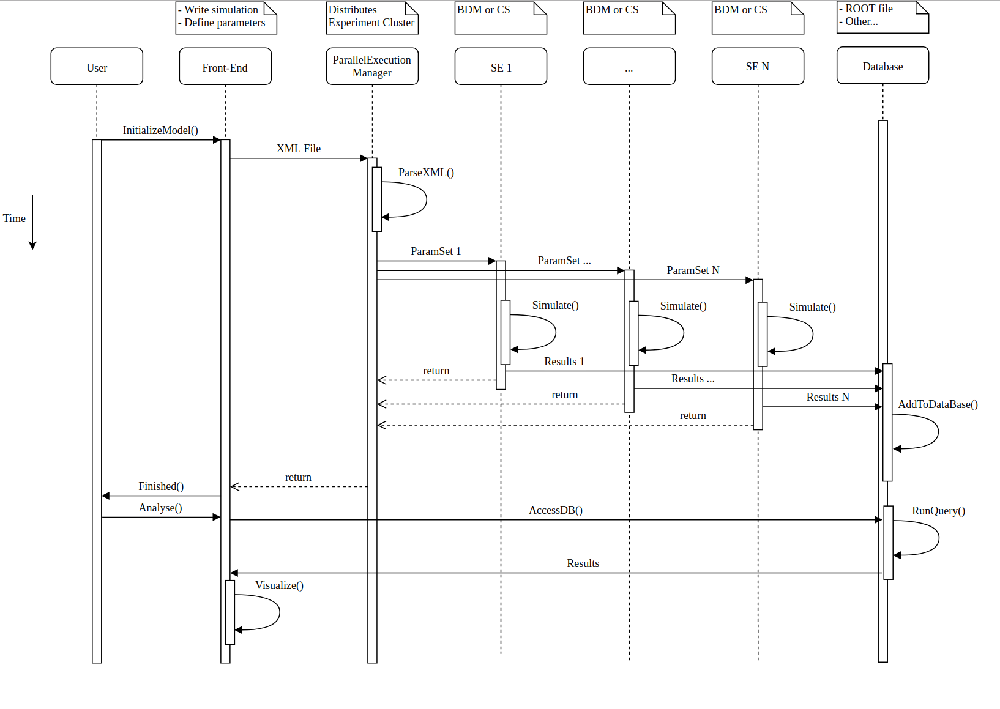

# Parallel Execution: What and Why?

With BioDynaMo it is possible to run multiple simulations in parallel, as
separate processes. We refer to this as "Parallel Execution". This can be a
useful feature when you want to repeat a certain simulation multiple times;
possibly with different runtime parameters. Instead of running the simulations
one-by-one, with Parallel Execution it is possible to run multiple instances at
the same time, on one or more machines. This allows you to explore a parameter
space and obtain results at a much faster pace. The more computing resources are
available, the faster the simulations are completed. The parameter space that
should be explore can be expressed in an XML file.

<p align="center">
  
</p>

## Requirements
Parallel execution uses MPI to spawn different processes and schedule the
simulations on your system(s). We therefore recommend you to install OpenMPI
(recommended v3 or higher) on the system(s) you plan to use.

!!! Note If you work with more than one machine, you are required to have the
    same OpenMPI versions installed on all the machines in order for Parallel
    Execution to work properly.

    Furthermore, MPI requires you to have a passwordless SSH login to the other
    machines.

## Usage

### Single-machine command
There is little difference between creating and running a simulation as a single
process, or as multiple processes through Parallel Execution. You can simply
launch your simulations as follows:

``` sh
mpirun -np <N> <your_simulation_binary> --xml=<path/to/xml/file>
```

This command spawns `N - 1` number of processes that each will start a
simulation. The number of simulations that will eventually be performed depends
on the contents of your XML file: the more parameters you would like to explore,
the higher the number of simulations that need to be executed.

It is very likely that the number of simulations will be greater than `N`. Since
there can only be at most `N -1` simulation running at any given point in time,
the other simulations are queued, and scheduled to be executed whenever
computing resources become available.

### Multi-machine command
If you wish to include other machines (e.g. a cluster, or cloud instances), it
can simply be done as follows:

``` sh
mpirun -np <N> --hostfile <path/to/hostfile> <your_simulation_binary> --xml=<path/to/xml/file>
```

The `hostfile` should contain the names (e.g. IP addresses) of the machines in
your cluster. For detailed information on how to create a hostfile, please check
out the OpenMPI docs [^1].

  [^1]: https://www.open-mpi.org/faq/?category=running#mpirun-hostfile

### XML File
The XML file that is required for Parallel Execution describes the parameters
over which you would like to run your simulations with. Your XML file should
adhere to the following structure:

``` xml
<?xml version="1.0" encoding="utf-8"?>
<model>
  <simulation_objects>
    <object>
      <property1>Value1</property1>
      <property2>Value2</property2>
      ...
      <property3>Value3</property3>
    </object>
  </simulation_objects>
  <biology_modules>
    <module>
      <property1>Value1</property1>
      <property2>Value2</property2>
      ...
      <property3>Value3</property3>
    </module>
  </biology_modules>
</model>
```

With in the `simulation_objects` XML node, you can specify the parameters you
would like to set certain properties of you simulation objects with. For each
simulation object you are required to create a `object` XML node, and therein
list the desired properties. The same principle is used to list the parameters
for the biology modules in your simulation.

Each property can be of the following three value types:

|  Value type  |      Description      | 
| -------- |-------------|
| scalar | A single-valued parameter (e.g. 42, 3.14) |
| range |  A range of values with a constant stride (e.g. [1, 2, 3, 4] or [0.2, 0.4, 0.6]) |
| set |  A set of values (e.g. [0, -21, 0.4]) |

All values are currently expected to be numerical values.

#### Scalar example
The following example sets the value of `property1` to 42.
``` xml
<property1 value_type="scalar">42</property1>
```

#### Range example
The following example sets the value of `property2` to one of the six values in
the range of [0, 1, 2, 3, 4, 5]. This will result in six different simulations
being run; each with a different value for `property2`.
``` xml
<property2 value_type="range">
  <min>0</min>
  <max>5</max>
  <stride>1</stride>
</property2>
```

#### Set example
The following example sets the value of `property3` to one of the three values
in the set of values [0, -21, 0.4]
``` xml
<property3 value_type="set">
  <value>0</value>
  <value>-21</value>
  <value>0.4</value>
</property3>
```

### How does it work?

A schematic overview of how the Parallel Execution engine works is shown in the
figure below.



In short, we parse the XML file with a 'master process' that determines the
entire parameter space that should be explored. Each valid set of parameters is
then dispatched to a 'worker process' that runs on either the same machine as
the master, or on a different machine. The number of worker processes is equal
to the `N - 1` number of processes with which the `mpirun` command was invoked
with. Upon receipt of the parameter set, the worker then executes the simulation
binary and saves the user-defined results to disk.

We use an XML parsers that is part of the ROOT library. We also use ROOT to
perform the serialization of the parameters that are dispatched using MPI.
Furthermore, the output files are saved in ROOT format, and can easily be merged
into a single file using ROOT's `hadd` executable. The ROOT file format is used
primarily in high-energy physics to store experimental and simulation data, and
fits rather nicely in BioDynaMo to store simulation results. Post processing and
analysis of data can be done with ROOT in a straightforward manner, and many
examples and tutorials can be found online [^2].

  [^2]: https://root.cern/doc/master/group__Tutorials.html

Since we rely on MPI to distribute the simulation workloads over a specified
number of processes, we are able to finetune the performance through the many
options that come with the MPI implementation. Important for the performance of
multi-threaded applications is being able to tweak the number of threads that
each process is able to spawn, the thread affinity, and other related
parameters. These parameters are conveniently described online [^3].

  [^3]: https://www.open-mpi.org/doc/v3.0/man1/mpirun.1.php


